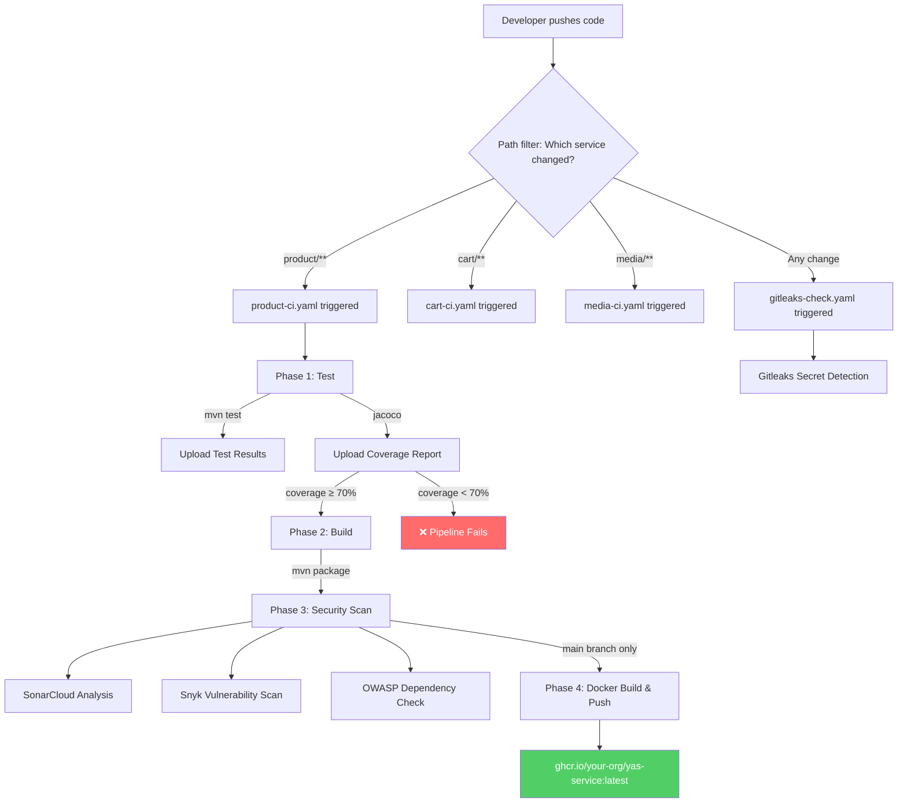

# YAS CI/CD Pipeline — Step-by-Step Implementation Guide

> **Project:** YAS (Yet Another Shop) — Microservices in Java  
> **CI/CD Tool:** GitHub Actions  
> **Source Repo:** https://github.com/nashtech-garage/yas

---

## Table of Contents

1. [Phase 1: Fork & Repository Setup](#phase-1-fork--repository-setup)
2. [Phase 2: Branch Protection Rules](#phase-2-branch-protection-rules)
3. [Phase 3: Understand Existing GitHub Actions Workflows](#phase-3-understand-existing-github-actions-workflows)
4. [Phase 4: Adjust Pipelines — Test & Build Phases with Coverage](#phase-4-adjust-pipelines--test--build-phases-with-coverage)
5. [Phase 5: Monorepo Path Filtering (Already Configured)](#phase-5-monorepo-path-filtering-already-configured)
6. [Phase 6: Setup SonarQube / SonarCloud](#phase-6-setup-sonarqube--sonarcloud)
7. [Phase 7: Setup Snyk](#phase-7-setup-snyk)
8. [Phase 8: Setup Gitleaks](#phase-8-setup-gitleaks)
9. [Phase 9: Enforce Coverage > 70% Gate](#phase-9-enforce-coverage--70-gate)
10. [Phase 10: Add Unit Tests (Per Service Branch)](#phase-10-add-unit-tests-per-service-branch)
11. [Phase 11: Complete Enhanced Pipeline Example](#phase-11-complete-enhanced-pipeline-example)
12. [Checklist Summary](#checklist-summary)

---

## Phase 1: Fork & Repository Setup

### Step 1.1 — Fork the Repository

1. Go to https://github.com/nashtech-garage/yas
2. Click **Fork** (top-right corner)
3. Select your team's GitHub organization or personal account
4. Keep all branches (uncheck "Copy the `main` branch only" if you want all branches)
5. Click **Create fork**

### Step 1.2 — Clone Your Fork Locally

```bash
git clone https://github.com/<YOUR-ORG>/yas.git
cd yas
```

### Step 1.3 — Set Upstream Remote (Optional)

```bash
git remote add upstream https://github.com/nashtech-garage/yas.git
git fetch upstream
```

---

## Phase 2: Branch Protection Rules

> **Requirement:** No direct push to `main`. Each PR requires **≥ 2 reviewer approvals** and **CI must pass** before merge.

### Step 2.1 — Navigate to Branch Protection Settings

1. Go to your forked repo on GitHub
2. Click **Settings** → **Branches** (left sidebar under "Code and automation")
3. Under **Branch protection rules**, click **Add branch protection rule**

### Step 2.2 — Configure the Rule

| Setting | Value |
|---|---|
| **Branch name pattern** | `main` |
| **Require a pull request before merging** | ✅ Checked |
| **Required number of approvals** | `2` |
| **Dismiss stale pull request approvals when new commits are pushed** | ✅ Recommended |
| **Require status checks to pass before merging** | ✅ Checked |
| **Require branches to be up to date before merging** | ✅ Checked |
| **Status checks that are required** | Select your CI workflow job names (e.g. `Build`) |
| **Do not allow bypassing the above settings** | ✅ Checked |

### Step 2.3 — Save the Rule

Click **Create** to save. Now no one can push directly to `main`.

> [!IMPORTANT]
> After your CI workflows run at least once, go back here and add the specific status check names (e.g., `Build` from each service CI workflow) so GitHub knows which checks are required.

---

## Phase 3: Understand Existing GitHub Actions Workflows

The original YAS repository already has a well-structured CI setup. Here's what exists:

### 3.1 — Existing Workflow Files

```
.github/workflows/
├── actions/
│   └── action.yaml              # Reusable composite action (setup JDK 25 + Maven cache + SonarCloud cache)
├── backoffice-bff-ci.yaml
├── backoffice-ci.yaml
├── cart-ci.yaml
├── charts-ci.yaml
├── codeql.yml
├── customer-ci.yaml
├── gitleaks-check.yaml           # Already exists! (nightly schedule)
├── inventory-ci.yaml
├── location-ci.yaml
├── media-ci.yaml
├── order-ci.yaml
├── payment-ci.yaml
├── payment-paypal-ci.yaml
├── product-ci.yaml
├── promotion-ci.yaml
├── rating-ci.yaml
├── recommendation-ci.yaml
├── sampledata-ci.yaml
├── search-ci.yaml
├── storefront-bff-ci.yaml
├── storefront-ci.yaml
├── tax-ci.yaml
└── webhook-ci.yaml
```

### 3.2 — Existing Reusable Action (`.github/workflows/actions/action.yaml`)

This composite action is used by all Java service workflows:

```yaml
runs:
  using: "composite"
  steps:
    - name: Set up JDK 25
      uses: actions/setup-java@v4
      with:
        java-version: '25'
        distribution: 'temurin'
        cache: 'maven'
    - name: Cache SonarCloud packages
      uses: actions/cache@v4
      with:
        path: ~/.sonar/cache
        key: ${{ runner.os }}-sonar
        restore-keys: ${{ runner.os }}-sonar
```

### 3.3 — Existing Java Service Pipeline Pattern (e.g. `product-ci.yaml`)

Each Java service already has:

| Phase | Step | Status |
|---|---|---|
| **Trigger** | Path-filtered on service directory | ✅ Already done |
| **Setup** | JDK 25 + Maven cache via composite action | ✅ Already done |
| **Build & Test** | `mvn clean install -pl <service> -am` | ✅ Already done |
| **Checkstyle** | `mvn checkstyle:checkstyle` | ✅ Already done |
| **Test Results** | Upload via `dorny/test-reporter` | ✅ Already done |
| **SonarCloud** | `sonar-maven-plugin:sonar` | ✅ Already done |
| **OWASP Dep Check** | `dependency-check/Dependency-Check_Action` | ✅ Already done |
| **Coverage Report** | `madrapps/jacoco-report` with min thresholds | ✅ Already done |
| **Docker Build/Push** | Build & push to GHCR (main branch only) | ✅ Already done |

### 3.4 — Existing Next.js Service Pipeline Pattern (e.g. `storefront-ci.yaml`)

| Phase | Step | Status |
|---|---|---|
| **Trigger** | Path-filtered on service directory | ✅ Already done |
| **Setup** | Node.js 20 | ✅ Already done |
| **Build** | `npm ci` → `npm run build` | ✅ Already done |
| **Lint** | `npm run lint` + `prettier --check` | ✅ Already done |
| **SonarCloud** | `SonarSource/sonarcloud-github-action` | ✅ Already done |
| **Docker Build/Push** | Build & push to GHCR (main branch only) | ✅ Already done |

> [!NOTE]
> The existing pipelines are **already very well-structured**. Your task is to:
> 1. Adjust triggers to work on **all branches** (not just `main`)
> 2. Add **Snyk** scanning
> 3. Enhance **Gitleaks** to run on every PR (not just nightly)
> 4. Enforce **>70% coverage** gate
> 5. Split into explicit **Test** and **Build** phases

---

## Phase 4: Adjust Pipelines — Test & Build Phases with Coverage

> **Requirement:** Pipeline needs at least 2 phases: **test** and **build**. Test phase must upload test results and coverage.

### Step 4.1 — What to Change

The existing workflows combine test + build into one job. We need to:
1. **Allow CI to run on all branches** (not just `main`/PRs to `main`)
2. **Split into 2 explicit jobs**: `Test` and `Build`
3. **Upload test results and coverage reports** in the test phase

### Step 4.2 — Modify Trigger to Support All Branches

Change the `on:` section in each workflow file. Replace:

```yaml
on:
  push:
    branches: [ "main" ]
    paths:
      - "product/**"
      # ...
  pull_request:
    branches: [ "main" ]
    paths:
      - "product/**"
      # ...
```

With:

```yaml
on:
  push:
    paths:
      - "product/**"
      - ".github/workflows/actions/action.yaml"
      - ".github/workflows/product-ci.yaml"
      - "pom.xml"
  pull_request:
    paths:
      - "product/**"
      - ".github/workflows/actions/action.yaml"
      - ".github/workflows/product-ci.yaml"
      - "pom.xml"
  workflow_dispatch:
```

> [!TIP]
> By removing `branches: [ "main" ]`, the pipeline will trigger on **any branch** that has changes in the service directory. This satisfies Requirement #4 (scan and run pipeline for each branch).

### Step 4.3 — Split into Test and Build Jobs

Here's the pattern for a Java service (e.g., `product-ci.yaml`):

```yaml
name: product service ci

on:
  push:
    paths:
      - "product/**"
      - ".github/workflows/actions/action.yaml"
      - ".github/workflows/product-ci.yaml"
      - "pom.xml"
  pull_request:
    paths:
      - "product/**"
      - ".github/workflows/actions/action.yaml"
      - ".github/workflows/product-ci.yaml"
      - "pom.xml"
  workflow_dispatch:

jobs:
  # ========================
  #  PHASE 1: TEST
  # ========================
  Test:
    runs-on: ubuntu-latest
    env:
      FROM_ORIGINAL_REPOSITORY: ${{ github.event.pull_request.head.repo.full_name == github.repository || github.ref == 'refs/heads/main' }}
    steps:
      - uses: actions/checkout@v4
        with:
          fetch-depth: 0

      - uses: ./.github/workflows/actions

      - name: Run Tests
        run: mvn clean test -pl product -am

      - name: Upload Test Results
        uses: dorny/test-reporter@v1
        if: success() || failure()
        with:
          name: Product-Service-Unit-Test-Results
          path: "product/**/*-reports/TEST*.xml"
          reporter: java-junit

      - name: Generate Coverage Report
        run: mvn jacoco:report -pl product

      - name: Upload Coverage to Artifacts
        uses: actions/upload-artifact@v4
        with:
          name: product-coverage-report
          path: product/target/site/jacoco/

      - name: Add Coverage Report to PR
        uses: madrapps/jacoco-report@v1.6.1
        if: github.event_name == 'pull_request'
        with:
          paths: ${{ github.workspace }}/product/target/site/jacoco/jacoco.xml
          token: ${{ secrets.GITHUB_TOKEN }}
          min-coverage-overall: 70
          min-coverage-changed-files: 60
          title: 'Product Coverage Report'
          update-comment: true

  # ========================
  #  PHASE 2: BUILD
  # ========================
  Build:
    runs-on: ubuntu-latest
    needs: Test    # Build only runs after Test passes
    steps:
      - uses: actions/checkout@v4
        with:
          fetch-depth: 0

      - uses: ./.github/workflows/actions

      - name: Build with Maven (skip tests)
        run: mvn clean package -pl product -am -DskipTests

      - name: Run Maven Checkstyle
        run: mvn checkstyle:checkstyle -pl product -am

      - name: Log in to the Container registry
        if: ${{ github.ref == 'refs/heads/main' }}
        uses: docker/login-action@v3
        with:
          registry: ghcr.io
          username: ${{ github.actor }}
          password: ${{ secrets.GITHUB_TOKEN }}

      - name: Build and push Docker images
        if: ${{ github.ref == 'refs/heads/main' }}
        uses: docker/build-push-action@v6
        with:
          context: ./product
          push: true
          tags: ghcr.io/<YOUR-ORG>/yas-product:latest
```

> [!IMPORTANT]
> Replace `<YOUR-ORG>` with your actual GitHub organization/username in the Docker image tags.

---

## Phase 5: Monorepo Path Filtering (Already Configured)

> **Requirement:** Only trigger pipeline for the specific service that changed.

### Already Done ✅

The existing workflows already use `paths:` filters:

```yaml
on:
  push:
    paths:
      - "product/**"                                    # Only triggers when product/ changes
      - ".github/workflows/actions/action.yaml"         # Also triggers on shared action changes
      - ".github/workflows/product-ci.yaml"             # Also triggers on own workflow changes
      - "pom.xml"                                       # Root POM changes
```

Each service has its own workflow file with its own path filter. **No changes needed here.**

Example mapping:

| Service | Workflow File | Path Filter |
|---|---|---|
| Product | `product-ci.yaml` | `product/**` |
| Cart | `cart-ci.yaml` | `cart/**` |
| Media | `media-ci.yaml` | `media/**` |
| Order | `order-ci.yaml` | `order/**` |
| Payment | `payment-ci.yaml` | `payment/**` |
| Storefront | `storefront-ci.yaml` | `storefront/**` |
| ... | ... | ... |

---

## Phase 6: Setup SonarQube / SonarCloud

> **Requirement 7c:** Use SonarQube to scan code quality and security vulnerabilities.

The existing repo already uses **SonarCloud** (the cloud-hosted version of SonarQube). You can either keep SonarCloud or switch to a self-hosted SonarQube instance.

### Option A: Use SonarCloud (Recommended — Already Partially Configured)

#### Step 6A.1 — Create a SonarCloud Account

1. Go to https://sonarcloud.io
2. Click **Log in with GitHub**
3. Authorize SonarCloud to access your GitHub account

#### Step 6A.2 — Import Your Forked Repository

1. Click **+** → **Analyze new project**
2. Select your forked `yas` repository
3. Click **Set Up**
4. Choose **GitHub Actions** as your CI method

#### Step 6A.3 — Get the SONAR_TOKEN

1. In SonarCloud, go to **My Account** → **Security**
2. Generate a new token → copy it
3. In your GitHub repo, go to **Settings** → **Secrets and variables** → **Actions**
4. Click **New repository secret**
5. Name: `SONAR_TOKEN`, Value: paste the token

#### Step 6A.4 — Configure `sonar-project.properties` for Each Java Service

Each Java service already analyzes via Maven plugin. The configuration is in each service's `pom.xml`. Verify that the `sonar.organization` and `sonar.projectKey` properties are set correctly.

For each Java service, the existing workflow runs:
```yaml
- name: Analyze with sonar cloud
  env:
    SONAR_TOKEN: ${{ secrets.SONAR_TOKEN }}
  run: mvn org.sonarsource.scanner.maven:sonar-maven-plugin:sonar -f product
```

#### Step 6A.5 — Configure SonarCloud for Next.js Services

For `storefront` and `backoffice` (Next.js), create `sonar-project.properties` in each directory:

```properties
# storefront/sonar-project.properties
sonar.projectKey=<YOUR-ORG>_yas-storefront
sonar.organization=<YOUR-ORG>
sonar.sources=.
sonar.exclusions=node_modules/**,coverage/**,.next/**
sonar.javascript.lcov.reportPaths=coverage/lcov.info
```

The existing workflow already uses the SonarCloud GitHub Action:
```yaml
- name: SonarCloud Scan
  uses: SonarSource/sonarcloud-github-action@master
  with:
    projectBaseDir: storefront
  env:
    GITHUB_TOKEN: ${{ secrets.GITHUB_TOKEN }}
    SONAR_TOKEN: ${{ secrets.SONAR_TOKEN }}
```

### Option B: Self-Hosted SonarQube

#### Step 6B.1 — Deploy SonarQube with Docker

```bash
docker run -d --name sonarqube \
  -p 9000:9000 \
  -v sonarqube_data:/opt/sonarqube/data \
  -v sonarqube_logs:/opt/sonarqube/logs \
  -v sonarqube_extensions:/opt/sonarqube/extensions \
  sonarqube:lts-community
```

#### Step 6B.2 — Configure SonarQube

1. Access http://localhost:9000 (default: `admin`/`admin`)
2. Change the default password
3. Create a new project for each service
4. Generate a project token

#### Step 6B.3 — Add Secrets to GitHub

| Secret Name | Value |
|---|---|
| `SONAR_TOKEN` | The project token from SonarQube |
| `SONAR_HOST_URL` | URL of your SonarQube (e.g. `http://<your-server>:9000`) |

#### Step 6B.4 — Modify Pipeline for Self-Hosted SonarQube

```yaml
- name: Analyze with SonarQube
  env:
    SONAR_TOKEN: ${{ secrets.SONAR_TOKEN }}
    SONAR_HOST_URL: ${{ secrets.SONAR_HOST_URL }}
  run: |
    mvn org.sonarsource.scanner.maven:sonar-maven-plugin:sonar \
      -f product \
      -Dsonar.host.url=$SONAR_HOST_URL \
      -Dsonar.login=$SONAR_TOKEN
```

---

## Phase 7: Setup Snyk

> **Requirement 7c:** Use Snyk to scan security vulnerabilities.

### Step 7.1 — Create a Snyk Account

1. Go to https://snyk.io
2. Click **Sign up** → **Sign up with GitHub**
3. Authorize Snyk to access your repositories

### Step 7.2 — Get the Snyk API Token

1. In Snyk, go to **Account Settings** → **General**
2. Find the **Auth Token** section → copy your API token

### Step 7.3 — Add Snyk Token to GitHub Secrets

1. In your GitHub repo → **Settings** → **Secrets and variables** → **Actions**
2. Click **New repository secret**
3. Name: `SNYK_TOKEN`, Value: paste the token

### Step 7.4 — Create a Snyk Scanning Workflow

Create `.github/workflows/snyk-security.yaml`:

```yaml
name: Snyk Security Scan

on:
  push:
    paths:
      - "**/pom.xml"
      - "**/package.json"
      - "**/package-lock.json"
      - ".github/workflows/snyk-security.yaml"
  pull_request:
    paths:
      - "**/pom.xml"
      - "**/package.json"
      - "**/package-lock.json"
      - ".github/workflows/snyk-security.yaml"
  workflow_dispatch:
  schedule:
    - cron: "0 6 * * 1"   # Weekly on Monday at 6:00 AM UTC

jobs:
  snyk-java-services:
    runs-on: ubuntu-latest
    strategy:
      fail-fast: false
      matrix:
        service:
          - product
          - cart
          - order
          - media
          - customer
          - inventory
          - location
          - payment
          - payment-paypal
          - promotion
          - rating
          - search
          - tax
          - webhook
          - recommendation
          - sampledata
          - backoffice-bff
          - storefront-bff
    steps:
      - uses: actions/checkout@v4

      - uses: ./.github/workflows/actions

      - name: Build project (compile only)
        run: mvn compile -pl ${{ matrix.service }} -am -DskipTests

      - name: Run Snyk to check for vulnerabilities
        uses: snyk/actions/maven@master
        continue-on-error: true   # Don't block the pipeline (advisory mode)
        env:
          SNYK_TOKEN: ${{ secrets.SNYK_TOKEN }}
        with:
          args: --severity-threshold=high --all-projects
          command: test

      - name: Upload Snyk results to GitHub Code Scanning
        uses: github/codeql-action/upload-sarif@v3
        if: always()
        continue-on-error: true
        with:
          sarif_file: snyk.sarif

  snyk-node-services:
    runs-on: ubuntu-latest
    strategy:
      fail-fast: false
      matrix:
        service: [storefront, backoffice]
    steps:
      - uses: actions/checkout@v4

      - uses: actions/setup-node@v4
        with:
          node-version: 20

      - name: Install dependencies
        run: npm ci
        working-directory: ${{ matrix.service }}

      - name: Run Snyk to check for vulnerabilities
        uses: snyk/actions/node@master
        continue-on-error: true
        env:
          SNYK_TOKEN: ${{ secrets.SNYK_TOKEN }}
        with:
          args: --severity-threshold=high --file=${{ matrix.service }}/package.json
          command: test
```

### Step 7.5 — (Optional) Add Snyk into Per-Service Pipelines

If you want Snyk to run as part of each service's individual CI, add this step to each workflow:

```yaml
      - name: Snyk Security Scan
        uses: snyk/actions/maven@master
        continue-on-error: true
        env:
          SNYK_TOKEN: ${{ secrets.SNYK_TOKEN }}
        with:
          args: --severity-threshold=high
          command: test
```

---

## Phase 8: Setup Gitleaks

> **Requirement 7c:** Use Gitleaks to scan for leaked secrets.

### 8.1 — Existing Gitleaks Configuration

The repo already has:
- **`gitleaks.toml`** — Configuration file at the repo root
- **`gitleaks-check.yaml`** — Workflow that runs **nightly** (scheduled)
- **`.gitleaksignore`** — File to ignore known False Positives

#### Existing `gitleaks.toml`:
```toml
title = "Gitleaks title"

[extend]
useDefault = true

[allowlist]
description = "global allow list"
paths = [
  '''test-realm.json''',
  '''realm-export''',
  '''keycloak-yas-realm-import.yaml''',
  '''target'''
]
```

#### Existing `gitleaks-check.yaml`:
```yaml
name: GitLeaks check nightly
on:
  workflow_dispatch:
  schedule:
    - cron: "0 0 * * *"
jobs:
  check:
    runs-on: ubuntu-latest
    steps:
    - name: Checkout 
      uses: actions/checkout@v4
      with:
        fetch-depth: 0
    - name: Gitleaks check
      run: |
        docker pull zricethezav/gitleaks:v8.18.4
        docker run --rm -v ${{ github.workspace }}:/work -w /work \
          zricethezav/gitleaks:v8.18.4 detect \
          --source="." --config="/work/gitleaks.toml" --verbose --no-git
```

### 8.2 — Enhance Gitleaks to Run on Every PR

Modify `.github/workflows/gitleaks-check.yaml` to also run on pushes and PRs:

```yaml
name: Gitleaks Secret Scan

on:
  push:
  pull_request:
  workflow_dispatch:
  schedule:
    - cron: "0 0 * * *"   # Keep nightly full scan

jobs:
  gitleaks:
    runs-on: ubuntu-latest
    steps:
      - name: Checkout
        uses: actions/checkout@v4
        with:
          fetch-depth: 0

      - name: Gitleaks Scan 
        uses: gitleaks/gitleaks-action@v2
        env:
          GITHUB_TOKEN: ${{ secrets.GITHUB_TOKEN }}
          GITLEAKS_LICENSE: ${{ secrets.GITLEAKS_LICENSE }}   # Optional, needed for gitleaks-action v2 on paid plans. Remove if not applicable.

      # --- OR use the Docker approach (free, no license needed) ---
      # - name: Gitleaks Scan (Docker)
      #   run: |
      #     docker pull zricethezav/gitleaks:v8.18.4
      #     docker run --rm -v ${{ github.workspace }}:/work -w /work \
      #       zricethezav/gitleaks:v8.18.4 detect \
      #       --source="." --config="/work/gitleaks.toml" --verbose --no-git
```

> [!TIP]
> **Free alternative:** If you don't have a Gitleaks license, use the Docker approach (uncomment the Docker steps, comment out the `gitleaks-action`). The Docker method is completely free.

### 8.3 — Understanding the `.gitleaksignore` File

If Gitleaks reports false positives, add the fingerprint to `.gitleaksignore`:

```
# .gitleaksignore
# Format: <RuleID>:<Commit>:<File>:<Secret>
# Or: <fingerprint> from the gitleaks report
```

---

## Phase 9: Enforce Coverage > 70% Gate

> **Requirement 7b:** Pipeline should only pass when test coverage > 70%.

### Step 9.1 — For Java Services (JaCoCo)

The existing pipeline already uses `madrapps/jacoco-report`. Adjust the thresholds:

```yaml
      - name: Add Coverage Report to PR
        uses: madrapps/jacoco-report@v1.6.1
        if: github.event_name == 'pull_request'
        with:
          paths: ${{ github.workspace }}/product/target/site/jacoco/jacoco.xml
          token: ${{ secrets.GITHUB_TOKEN }}
          min-coverage-overall: 70       # ← FAIL if total coverage < 70%
          min-coverage-changed-files: 60
          title: 'Product Coverage Report'
          update-comment: true
```

Additionally, enforce it via **Maven JaCoCo plugin** in each service's `pom.xml`:

```xml
<plugin>
    <groupId>org.jacoco</groupId>
    <artifactId>jacoco-maven-plugin</artifactId>
    <version>0.8.12</version>
    <executions>
        <execution>
            <id>prepare-agent</id>
            <goals><goal>prepare-agent</goal></goals>
        </execution>
        <execution>
            <id>report</id>
            <phase>test</phase>
            <goals><goal>report</goal></goals>
        </execution>
        <execution>
            <id>check</id>
            <goals><goal>check</goal></goals>
            <configuration>
                <rules>
                    <rule>
                        <element>BUNDLE</element>
                        <limits>
                            <limit>
                                <counter>LINE</counter>
                                <value>COVEREDRATIO</value>
                                <minimum>0.70</minimum>  <!-- 70% minimum -->
                            </limit>
                        </limits>
                    </rule>
                </rules>
            </configuration>
        </execution>
    </executions>
</plugin>
```

### Step 9.2 — For Next.js Services (Istanbul/NYC)

Add a test + coverage script in `storefront/package.json`:

```json
{
  "scripts": {
    "test": "jest",
    "test:coverage": "jest --coverage --coverageThreshold='{\"global\":{\"branches\":70,\"functions\":70,\"lines\":70,\"statements\":70}}'"
  }
}
```

In the workflow, add:

```yaml
      - name: Run Tests with Coverage
        run: npm run test:coverage
        working-directory: storefront

      - name: Upload Coverage Report
        uses: actions/upload-artifact@v4
        with:
          name: storefront-coverage
          path: storefront/coverage/
```

---

## Phase 10: Add Unit Tests (Per Service Branch)

> **Requirement 7a:** Create a new branch per service to add unit tests.

### Step 10.1 — Branch Naming Convention

```bash
# Create a branch for each service
git checkout -b feature/unit-tests-product
git checkout -b feature/unit-tests-cart
git checkout -b feature/unit-tests-media
git checkout -b feature/unit-tests-order
git checkout -b feature/unit-tests-customer
# ... etc
```

### Step 10.2 — Write Unit Tests

For Java services, tests go in `<service>/src/test/java/...`. Example for product service:

```java
// product/src/test/java/com/yas/product/service/ProductServiceTest.java
package com.yas.product.service;

import org.junit.jupiter.api.Test;
import org.junit.jupiter.api.extension.ExtendWith;
import org.mockito.InjectMocks;
import org.mockito.Mock;
import org.mockito.junit.jupiter.MockitoExtension;
// ... imports

@ExtendWith(MockitoExtension.class)
class ProductServiceTest {

    @Mock
    private ProductRepository productRepository;

    @InjectMocks
    private ProductService productService;

    @Test
    void getProductById_ShouldReturnProduct_WhenProductExists() {
        // Arrange
        // Act
        // Assert
    }

    @Test
    void getProductById_ShouldThrowException_WhenProductNotFound() {
        // Arrange
        // Act & Assert
    }
}
```

### Step 10.3 — Push and Create PR

```bash
git add .
git commit -m "feat(product): add unit tests for ProductService"
git push origin feature/unit-tests-product
```

Then create a Pull Request from `feature/unit-tests-product` → `main`.

> [!IMPORTANT]
> Keep at least 1 PR in **open** status as required by the submission guidelines.

---

## Phase 11: Complete Enhanced Pipeline Example

Here's a **fully enhanced** pipeline for a Java service that meets **ALL requirements**:

```yaml
# .github/workflows/product-ci.yaml
name: product service ci

on:
  push:
    paths:
      - "product/**"
      - ".github/workflows/actions/action.yaml"
      - ".github/workflows/product-ci.yaml"
      - "pom.xml"
  pull_request:
    paths:
      - "product/**"
      - ".github/workflows/actions/action.yaml"
      - ".github/workflows/product-ci.yaml"
      - "pom.xml"
  workflow_dispatch:

jobs:
  # ========================================
  #  PHASE 1: TEST (Unit Tests + Coverage)
  # ========================================
  Test:
    runs-on: ubuntu-latest
    steps:
      - uses: actions/checkout@v4
        with:
          fetch-depth: 0

      - uses: ./.github/workflows/actions

      - name: Run Tests with Coverage
        run: mvn clean test -pl product -am

      - name: Upload Test Results
        uses: dorny/test-reporter@v1
        if: success() || failure()
        with:
          name: Product-Unit-Test-Results
          path: "product/**/*-reports/TEST*.xml"
          reporter: java-junit

      - name: Upload Coverage Artifact
        uses: actions/upload-artifact@v4
        with:
          name: product-coverage
          path: product/target/site/jacoco/

      - name: Coverage Report on PR
        uses: madrapps/jacoco-report@v1.6.1
        if: github.event_name == 'pull_request'
        with:
          paths: ${{ github.workspace }}/product/target/site/jacoco/jacoco.xml
          token: ${{ secrets.GITHUB_TOKEN }}
          min-coverage-overall: 70
          min-coverage-changed-files: 60
          title: '📊 Product Coverage Report'
          update-comment: true

  # ========================================
  #  PHASE 2: BUILD + CODE QUALITY
  # ========================================
  Build:
    runs-on: ubuntu-latest
    needs: Test
    steps:
      - uses: actions/checkout@v4
        with:
          fetch-depth: 0

      - uses: ./.github/workflows/actions

      - name: Build with Maven
        run: mvn clean package -pl product -am -DskipTests

      - name: Checkstyle
        run: mvn checkstyle:checkstyle -pl product -am

  # ========================================
  #  PHASE 3: SECURITY SCANNING
  # ========================================
  Security-Scan:
    runs-on: ubuntu-latest
    needs: Test
    steps:
      - uses: actions/checkout@v4
        with:
          fetch-depth: 0

      - uses: ./.github/workflows/actions

      # --- SonarCloud ---
      - name: SonarCloud Analysis
        env:
          SONAR_TOKEN: ${{ secrets.SONAR_TOKEN }}
        run: |
          mvn clean verify -pl product -am \
            org.sonarsource.scanner.maven:sonar-maven-plugin:sonar \
            -Dsonar.projectKey=<YOUR-ORG>_yas-product

      # --- Snyk ---
      - name: Snyk Vulnerability Scan
        uses: snyk/actions/maven@master
        continue-on-error: true
        env:
          SNYK_TOKEN: ${{ secrets.SNYK_TOKEN }}
        with:
          args: --severity-threshold=high
          command: test

      # --- OWASP Dependency Check ---
      - name: OWASP Dependency Check
        uses: dependency-check/Dependency-Check_Action@main
        env:
          JAVA_HOME: /opt/jdk
        with:
          project: 'yas-product'
          path: './product'
          format: 'HTML'

      - name: Upload OWASP Report
        uses: actions/upload-artifact@v4
        if: always()
        with:
          name: product-owasp-report
          path: ${{ github.workspace }}/reports

  # ========================================
  #  PHASE 4: DOCKER (main branch only)
  # ========================================
  Docker:
    runs-on: ubuntu-latest
    needs: [Build, Security-Scan]
    if: github.ref == 'refs/heads/main'
    steps:
      - uses: actions/checkout@v4

      - uses: ./.github/workflows/actions

      - name: Build Package
        run: mvn clean package -pl product -am -DskipTests

      - name: Log in to Container Registry
        uses: docker/login-action@v3
        with:
          registry: ghcr.io
          username: ${{ github.actor }}
          password: ${{ secrets.GITHUB_TOKEN }}

      - name: Build and Push Docker Image
        uses: docker/build-push-action@v6
        with:
          context: ./product
          push: true
          tags: ghcr.io/<YOUR-ORG>/yas-product:latest
```

> [!WARNING]
> Remember to replace `<YOUR-ORG>` with your actual GitHub organization or username everywhere.

---

## Checklist Summary

Use this checklist to track your progress:

| # | Requirement | Status |
|---|---|---|
| 1 | Using GitHub Actions for CI | ⬜ |
| 2 | Fork repo from nashtech-garage/yas | ⬜ |
| 3 | Branch protection: no direct push to main, 2 reviewers, CI must pass | ⬜ |
| 4 | Pipeline triggers on all branches (not just main) | ⬜ |
| 5 | Pipeline has ≥ 2 phases (Test + Build) with test results & coverage upload | ⬜ |
| 6 | Monorepo: Only changed service triggers its pipeline | ⬜ (Already done in original repo) |
| 7a | Add unit tests per service (separate branches) | ⬜ |
| 7b | Coverage gate > 70% | ⬜ |
| 7c | Gitleaks scanning | ⬜ (Enhance existing nightly → every PR) |
| 7c | SonarQube/SonarCloud scanning | ⬜ (Already configured, verify SONAR_TOKEN) |
| 7c | Snyk scanning | ⬜ (New — add workflow + SNYK_TOKEN) |
| — | At least 1 PR in open status | ⬜ |
| — | Screenshots of all configurations in report | ⬜ |

---

## Pipeline Architecture Diagram



---

## Secrets Summary

Make sure all these secrets are configured in your GitHub repository:

| Secret Name | Where to Get It | Required For |
|---|---|---|
| `SONAR_TOKEN` | SonarCloud → My Account → Security | SonarCloud analysis |
| `SNYK_TOKEN` | Snyk → Account Settings → Auth Token | Snyk vulnerability scanning |
| `GITHUB_TOKEN` | Auto-provided by GitHub Actions | PR comments, Docker push, Gitleaks |
| `GITLEAKS_LICENSE` | gitleaks.io (optional, needed for v2 action on private repos) | Gitleaks Action v2 |

> [!NOTE]
> `GITHUB_TOKEN` is **automatically provided** by GitHub Actions — you do NOT need to create it manually.

---

## Quick Reference: Applying Changes to All Services

Since the YAS monorepo has ~20 service workflows, you can use this shell script to batch-update all workflow files:

```bash
#!/bin/bash
# workflows.sh - Update all workflow triggers to support all branches

WORKFLOW_DIR=".github/workflows"

for file in "$WORKFLOW_DIR"/*-ci.yaml; do
  echo "Processing: $file"
  
  # Remove 'branches: [ "main" ]' lines to allow all branches
  sed -i '/branches: \[ "main" \]/d' "$file"
  
  echo "  ✅ Updated: $file"
done

echo "Done! All workflows now trigger on all branches."
```

> [!CAUTION]
> Review each file after running this script to make sure the YAML structure is still valid. The `sed` command may need adjustments depending on indentation.
